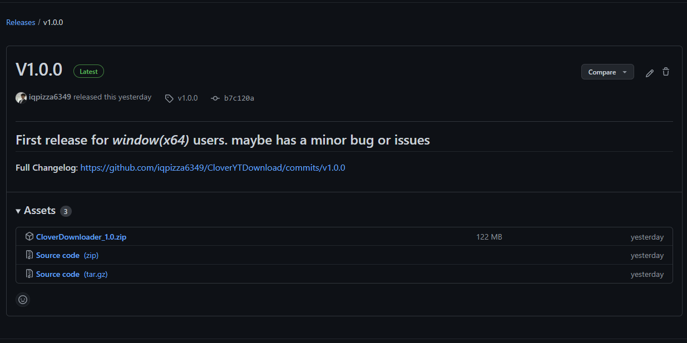
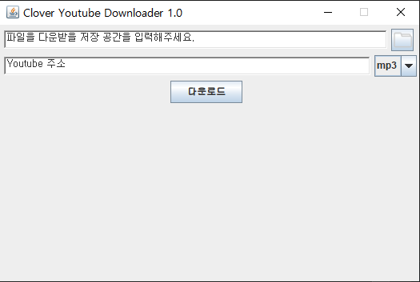

# CloverYoutubeDownloader
... is an application for users who want to download Youtube music .

## Getting Started

### Prerequisites
These project is developed with Java
requires JRE 11+ <br>
on Linux (especially Ubuntu 20.04)
```shell
$ sudo apt update
$ sudo apt install openjdk-11-jdk
# must export JAVA_HOME in /etc/bash.bashrc
```
on Windows (Windows 7+)
> [download in here](https://www.oracle.com/java/technologies/downloads/#java11)

### Installing
> currently, only supports Windows(x64) version .
1) Download latest release version

2) Download named **CloverDownloader_x.y.z.zip** (x, y, z is each version number)

## How to Run
1) Run '**run.bat**' <br>

2) Specify the path to download (click directory button) 
3) Add an Youtube URL into 2nd TextArea
4) If you download path and Youtube URL both, click download button to download
5) If mp3 file is downloaded successfully, file will in your download directory

## Built With
* Gradle - Dependency Management

## Terms of service
```markdown
CloverYoutubeDownloader(a.k.a CloverDownloader) provides technical services,
and you are solely responsible for the legality of your use of CloverDownloader.
CloverDownloader assumes no liability whatsoever in relation to the downloading of
content through CloverDownloader by users or outsiders .
```

## License
This project is licensed under the MIT License - see the LICENSE.md file for details

## Library
[youtube-dl](https://github.com/ytdl-org/youtube-dl/),
[youtubedl-java](https://github.com/sapher/youtubedl-java/), 
[ffmpeg](https://www.ffmpeg.org/legal.html)
